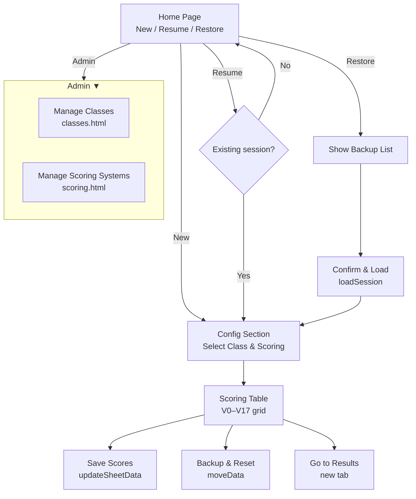

# Flow Chart

```mermaid
flowchart TD
  A[Home Page <br/> New / Resume / Restore] -->|New| B[Config Section <br/> Select Class & Scoring]
  A -->|Resume| C{Existing session?}
  C -->|Yes| B
  C -->|No| A
  A -->|Restore| D[Show Backup List]
  D --> E[Confirm & Load <br/>loadSession]
  E --> B

  B --> F[Scoring Table<br/>V0–V17 grid]
  F --> G[Save Scores<br/>updateSheetData]
  F --> H[Backup & Reset<br/>moveData]
  F --> I[Go to Results<br/>new tab]

  subgraph Admin_Menu [Admin ▼]
    J[Manage Classes<br/>classes.html]
    K[Manage Scoring Systems<br/>scoring.html]
  end
  A -->|Admin| Admin_Menu

  click J href "classes.html" _blank
  click K href "scoring.html" _blank
  click I href "results.html" _blank
```
