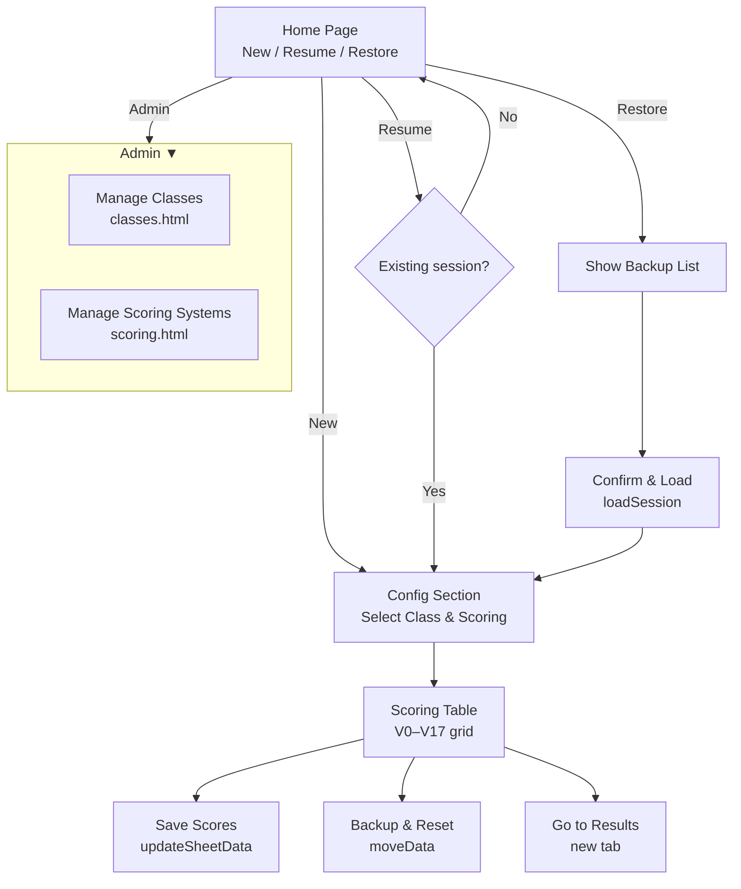

```mermaid
flowchart TD
  A[Home Page\nNew / Resume / Restore] -->|New| B[Config Section\nSelect Class & Scoring]
  A -->|Resume| C{Existing session?}
  C -->|Yes| B
  C -->|No| A
  A -->|Restore| D[Show Backup List]
  D --> E[Confirm & Load\nloadSession]
  E --> B

  B --> F[Scoring Table\nV0–V17 grid]
  F --> G[Save Scores\nupdateSheetData]
  F --> H[Backup & Reset\nmoveData]
  F --> I[Go to Results\nnew tab]

  subgraph Admin_Menu [Admin ▼]
    J[Manage Classes\nclasses.html]
    K[Manage Scoring Systems\nscoring.html]
  end
  A -->|Admin| Admin_Menu

  click J href "classes.html" _blank
  click K href "scoring.html" _blank
  click I href "results.html" _blank
```
