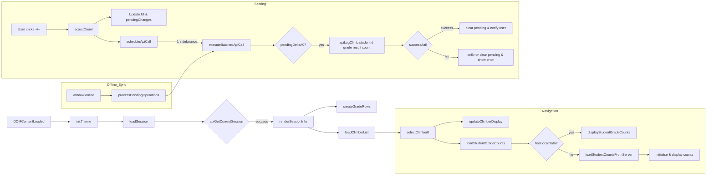

# Scoring Page

```mermaid
flowchart LR
 subgraph Navigation["Navigation"]
        I["updateClimberDisplay"]
        H["selectClimber0"]
        J["loadStudentGradeCounts"]
        K{"hasLocalData?"}
        L["displayStudentGradeCounts"]
        M["loadStudentCountsFromServer"]
        N["initialise & display counts"]
  end
 subgraph Scoring["Scoring"]
        P["adjustCount"]
        O["User clicks +/−"]
        Q["Update UI & pendingChanges"]
        R["scheduleApiCall"]
        S["executeBatchedApiCall"]
        T{"pendingDelta≠0?"}
        U["apiLogClimb studentId grade result count"]
        V{"success/fail"}
        W["clear pending & notify user"]
        X["onError clear pending & show error"]
  end
 subgraph Offline_Sync["Offline_Sync"]
        Z["processPendingOperations"]
        Y["window.online"]
  end
    A["DOMContentLoaded"] --> B["initTheme"]
    B --> C["loadSession"]
    C --> D{"apiGetCurrentSession"}
    D -- success --> E["renderSessionInfo"]
    E --> F["createGradeRows"] & G["loadClimberList"]
    G --> H
    H --> I & J
    J --> K
    K -- yes --> L
    K -- no --> M
    M --> N
    O --> P
    P --> Q & R
    R -- 1 s debounce --> S
    S --> T
    T -- yes --> U
    U --> V
    V -- success --> W
    V -- fail --> X
    Y --> Z
    Z --> S
```